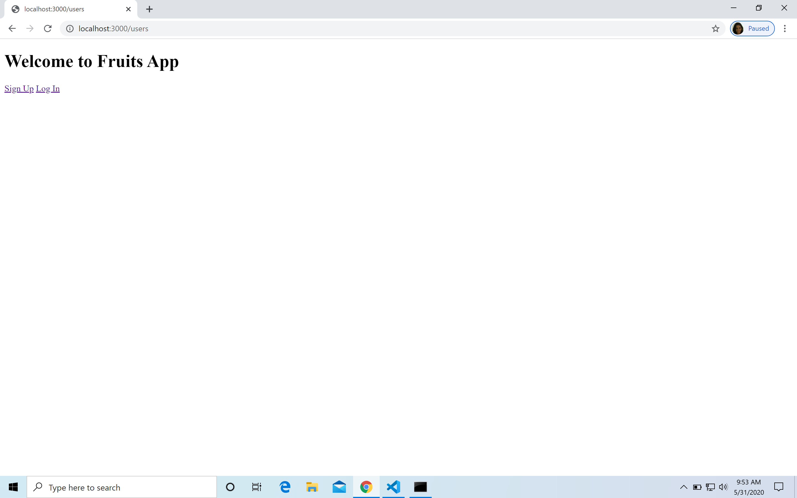
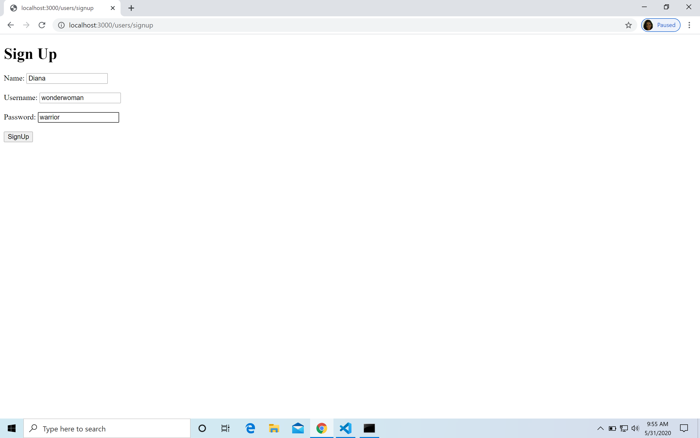
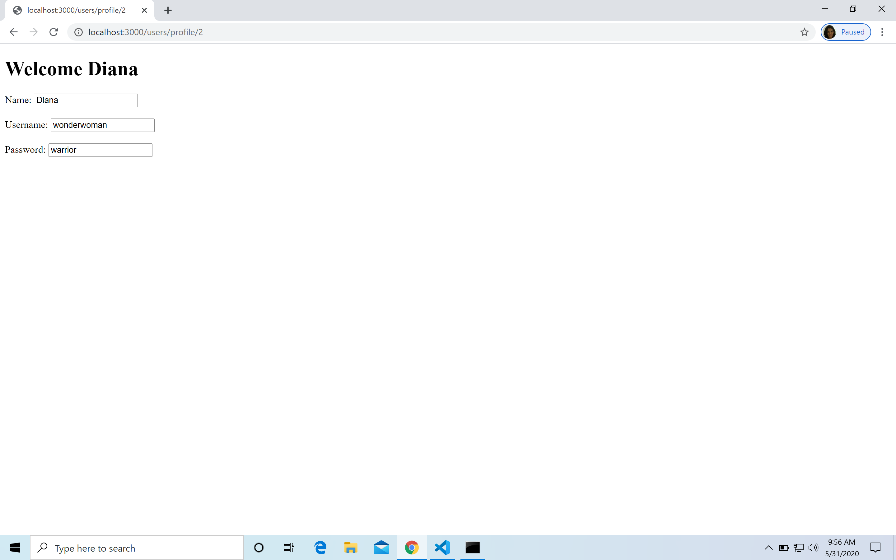
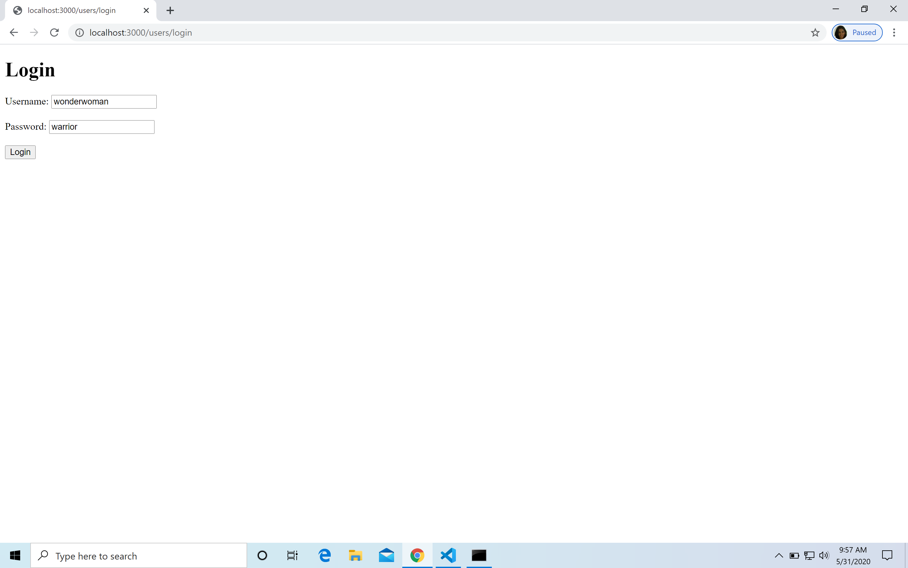
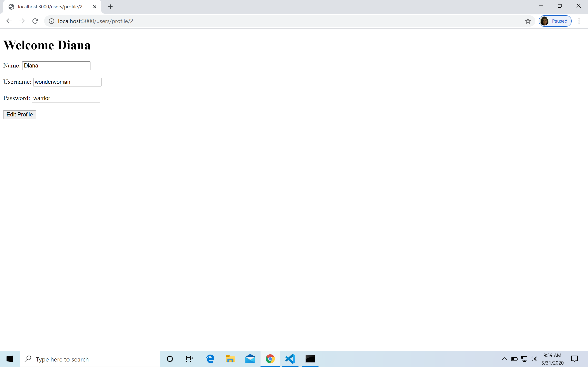
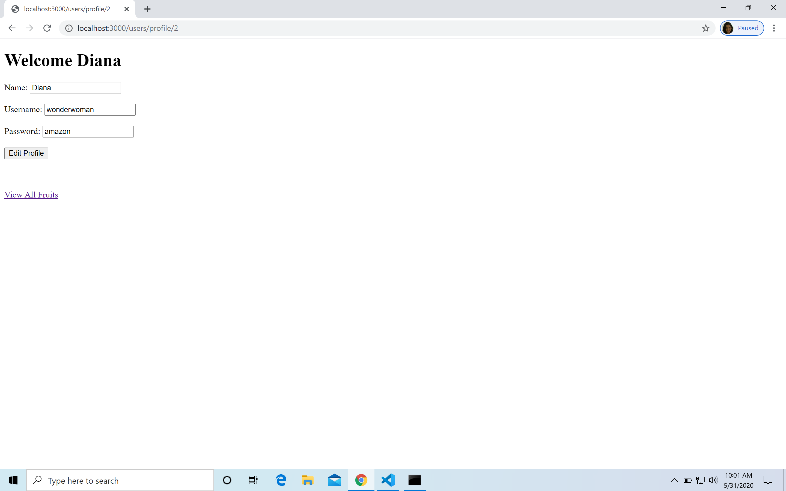
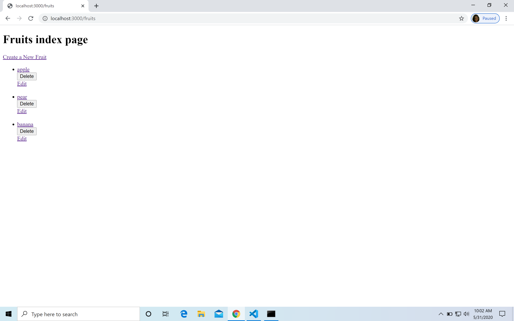
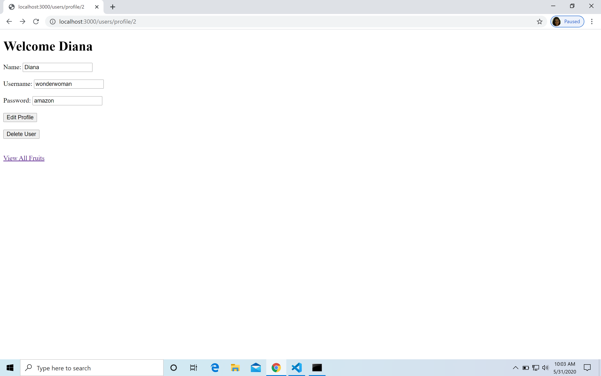

# Add User model

So far we have created `fruit-app` with CRUD on `fruits`. What we will now do is add another model to our app.

## Code Along
Just like before we will continue to build on our `fruit-app` but this time we will start by adding our user model.

### Create User Model

Let's add `users.js` under `models` folder.

```js
const users = [
    {
        name:'Tony Stark',
        username: 'ironman',
        password: 'prettyawesome'
    },
    {
        name:'Clark Kent',
        username: 'superman',
        password: `canfly`
    },
    {
        name:'Bruce Wayne',
        username: 'batman',
        password: 'hasgadgets'
    }
]

module.exports = users;
```

### Create Users Controller

Create `usersController.js` under `controllers` folder. Import the `users` model.

```js
const express = require("express");
const router = express.Router();

const users = require("../models/users");

module.exports = router;
```


### server.js

Finally, import `usersController.js` in `server.js`

```js
app.use("/users", require("./controllers/usersController.js"));
```

### Views

Create a new folder `users` under `views`. You will add all the view templates for user under this folder. Make sure to add the folder name while rendering a template. Like this, `res.render('users/index.ejs')`

## Independence Practice

Now that you have the skeleton ready, you are going to create APIs for the CRUD functionality on User model. But this time we will do things little differently. 

You can view the solution code [here](https://git.generalassemb.ly/john-deere-sei-7/express-user-model/tree/master/marc-solution/fruit-app) for reference. Also, you can click on the link for each step to view the changes for that specific commit. Ignore the updates to the README file.

What you have below are screenshots to the functionality that needs to be implemented, in the order that you have to implement it in.

**Commit after each step**

1. Start with the Homepage. [Add Signup and login links](https://git.generalassemb.ly/john-deere-sei-7/express-user-model/commit/efd8d3f56d95b92ced24e15c1694810c04e4bd47)

	
	

1. [Signup form](https://git.generalassemb.ly/john-deere-sei-7/express-user-model/commit/1d94a85134738f14fa5cd61b5af629cffe5c4a5f)

	
	

1. Once User signs up, redirect to the profile page. [This step will require a POST and a GET route.](https://git.generalassemb.ly/john-deere-sei-7/express-user-model/commit/7e5e73dd47be0cc4b8f4aa7636291f38296a972a)

	

1. [Login form](https://git.generalassemb.ly/john-deere-sei-7/express-user-model/commit/4b81809d6b63f6d664672de1f8c1a9b4a6fc7e3c)

	
	
1. [After login, render profile page](https://git.generalassemb.ly/john-deere-sei-7/express-user-model/commit/b657fdc8a1925a6b8ebb8fa7678bfd96db095307)

	

- [Edit Profile](https://git.generalassemb.ly/john-deere-sei-7/express-user-model/commit/6e1ef91bea616b3ac8385817ddfb9db2b6ffb6e7)

	
	
- [After updating profile, render profile page](https://git.generalassemb.ly/john-deere-sei-7/express-user-model/commit/6e1ef91bea616b3ac8385817ddfb9db2b6ffb6e7)

	
	
- [Add link to view fruits index page on profile page](https://git.generalassemb.ly/john-deere-sei-7/express-user-model/commit/6e1ef91bea616b3ac8385817ddfb9db2b6ffb6e7)

	

- Fruits Index Page

	

- [Delete User](https://git.generalassemb.ly/john-deere-sei-7/express-user-model/commit/15b429638607da49938ce7ef20fce726b8745506)

	
	
- [After User is deleted, render user homepage](https://git.generalassemb.ly/john-deere-sei-7/express-user-model/commit/15b429638607da49938ce7ef20fce726b8745506)

	
